# Multi-Component OptiCAM Pipeline

## Complete Processing Pipeline

```mermaid
flowchart TD
    Start([Input: Image x]) --> LoadModel[Load Pre-trained CNN<br/>e.g., ResNet50]
    LoadModel --> ExtractFeatures[Extract Feature Maps F<br/>Shape: H×W×C<br/>C=2048 channels]
    
    ExtractFeatures --> InitWeights[Initialize Weights U_raw<br/>Shape: K×C<br/>]
    
    InitWeights --> OptLoop{Optimization Loop<br/>t = 1...T iterations}
    
    OptLoop --> ComputeWeights[Compute W = softmax U_raw per component<br/>Then compute beta weights]
    ComputeWeights --> GenerateMasks[Generate K Component Masks<br/>M_k = sigmoid F · beta_k<br/>k = 1...K]
    
    GenerateMasks --> CheckScaling{mask_scaling?}
    CheckScaling -->|True| ScaledForward[Scaled Forward:<br/>c_k = f beta_k · M_k ⊙ x]
    CheckScaling -->|False| UnscaledForward[Unscaled Forward:<br/>c_k = f M_k ⊙ x]
    
    ScaledForward --> CombinedMask[Combined Mask:<br/>M_combined = sum beta_k · M_k]
    UnscaledForward --> CombinedMask
    
    CombinedMask --> ForwardCombined[Forward Combined:<br/>c_combined = f M_combined ⊙ x]
    
    ForwardCombined --> ComputeFidelity[Compute Fidelity Loss:<br/>L_fid = MSE c_combined, c_orig]
    
    ComputeFidelity --> CheckLambda{lambda > 0?}
    CheckLambda -->|Yes| ComputeConsistency[Compute Consistency Loss:<br/>L_cons = MSE sum beta_k · c_k, c_orig]
    CheckLambda -->|No| SkipConsistency[L_cons = 0]
    
    ComputeConsistency --> TotalLoss[Total Loss:<br/>L = L_fid + lambda t · L_cons]
    SkipConsistency --> TotalLoss
    
    TotalLoss --> Backprop[Backpropagate grad L<br/>Update W_raw via Adam]
    
    Backprop --> CheckConverge{Converged?<br/>t < T?}
    CheckConverge -->|No| OptLoop
    CheckConverge -->|Yes| Normalize[Normalize Masks:<br/>M_k in 0,1]
    
    Normalize --> SaveOutputs[Save Outputs:<br/>K masks M_k<br/>Beta weights beta_k<br/>Overlay visualizations<br/>Loss histories]
    
    SaveOutputs --> ComputeMetrics[Compute Metrics:<br/>AD, AI, AG<br/>AUC Ins/Del<br/>AOPC Ins/Del<br/>Consistency Error]
    
    ComputeMetrics --> End([Output: K Component Masks<br/>+ Learned Weights beta])
    
    style Start fill:#e1f5e1
    style End fill:#ffe1e1
    style OptLoop fill:#fff4e1
    style CheckScaling fill:#e1f0ff
    style CheckLambda fill:#e1f0ff
    style CheckConverge fill:#e1f0ff
    style TotalLoss fill:#ffe1f0
    style ComputeMetrics fill:#f0e1ff
```



## Pipeline Explanation

### 1. Input Stage
- **Input**: RGB image x with dimensions H×W×3
- **Pre-trained Model**: ResNet50 or similar CNN architecture
- **Feature Extraction**: Extract feature maps F from last convolutional layer (2048 channels)

### 2. Initialization Stage
- **Weights Initialization**: U_raw ∈ ℝ^(K×C) 
  - Matrix with K rows (components) and C columns (channels = 2048)
  - Each row U_raw[j,:] represents learnable weights for component j
  - **Adaptive** (default): K=1 → constant, K>1 → constant + noise
  - **Random**: Gaussian N(0, 0.01)
  - **Constant**: Pure 0.5 (⚠️ symmetry issue if K>1)

### 3. Optimization Loop (T iterations)
- **Weight Normalization**: For each component j: W_j = softmax(U_raw[j,:])
  - Ensures Σ_k W_{j,k} = 1 for each component (weights sum to 1 over channels)
- **Beta Computation**: β = softmax(β_raw) ensures Σβ_j = 1
  - β_j represents importance of component j
- **Mask Generation**: M_j = σ(F · W_j) for j=1...K components
  - Each component has its own channel weights W_j
- **Forward Pass Branch**:
  - If `mask_scaling=True`: c_k = f(β_k · M_k ⊙ x)
  - If `mask_scaling=False`: c_k = f(M_k ⊙ x)
- **Combined Mask**: M_combined = Σ(β_k · M_k)
- **Fidelity Loss**: L_fid = ||c_combined - c_orig||²
- **Consistency Loss** (if λ > 0): L_cons = ||Σ(β_k · c_k) - c_orig||²
- **Total Loss**: L = L_fid + λ(t) · L_cons
- **Backpropagation**: Update U_raw and β_raw via Adam optimizer

### 4. Output Stage
- **Normalize**: All masks to [0,1] range
- **Save Artifacts**:
  - K component masks (M_1, M_2, ..., M_K)
  - Learned beta weights (β_1, β_2, ..., β_K)
  - Overlay visualizations
  - Loss histories (total, fidelity, consistency)
- **Compute Metrics**:
  - Average Drop (AD), Average Increase (AI), Average Gain (AG)
  - AUC Insertion/Deletion
  - AOPC Insertion/Deletion  
  - Consistency Error: |Σ(β_k · c_k) - c_orig|

## Key Decision Points

### Mask Scaling (Line 18)
Controls how beta weights are applied:
- **True**: Beta weights scale masks before forward pass (theory-consistent)
- **False**: Beta weights scale scores after forward pass (score-weighting)

### Lambda Consistency (Line 25)
Controls consistency constraint enforcement:
- **λ=0**: No explicit consistency (Config C)
- **λ=1.0**: Standard consistency (Config D)
- **λ>1**: Stronger consistency (may sacrifice fidelity)

### Convergence Check (Line 37)
Stops optimization when:
- Reached max iterations (t ≥ T)
- Or early stopping criteria met (delta_change_threshold)

## Implementation Details

**File**: `generate_opticam_multi.py`
**Key Parameters**:
- `--num_masks`: K components (default: 3)
- `--lambda_consistency`: λ value (default: 1.0)
- `--init_method`: Initialization strategy (default: "adaptive")
- `--max_iter`: T iterations (default: 10, recommend: 50-100)
- `--learning_rate`: Adam LR (default: 1e-6, recommend: 1e-3)
- `--mask_scaling`: Enable beta scaling (default: True)

**Example Command**:
```powershell
python generate_opticam_multi.py \
    --name_path "Multi_Standard_K3" \
    --num_masks 3 --lambda_consistency 1.0 \
    --init_method adaptive \
    --max_iter 50 --batch_size 5 --learning_rate 1e-3 \
    --mask_scaling
```

## References
- See `OPTICAM_THEORY_COMPREHENSIVE.md` for mathematical details
- See `Commands.txt` for all available flags and configurations
- See `util.py` lines 576-850 for implementation
